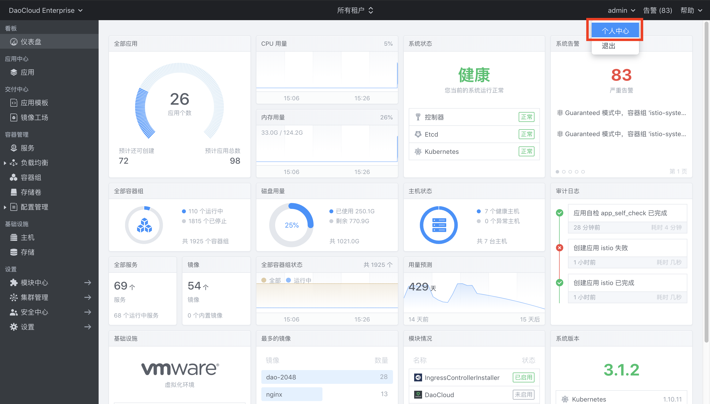
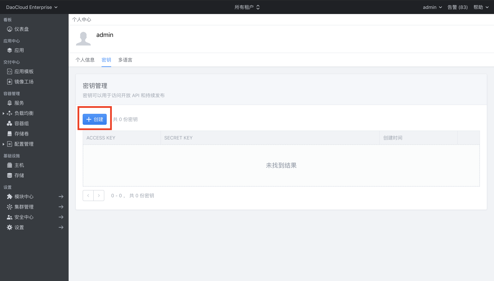

<h1 align="center">Istio 与 DCE 集成方案 ⛵️</h1>
<center><p>
  
  
</p></center>

[Istio](https://istio.io/zh) 是由 Google、IBM、Lyft 等共同开源的 Service Mesh（服务网格）框架，于2017年初开始进入大众视野，作为云原生时代下承 Kubernetes、上接 Serverless 架构的重要基础设施层，地位至关重要。

想快速了解 Istio 的流量治理功能，请参考：[Istio 流量管理](https://www.yangcs.net/posts/istio-traffic-management/)

本项目将会指导你如何在 DCE 中部署 Istio。

## 🚀 准备工作
首先需要在 DCE 控制台中创建访问秘钥

<div align=center></div>

<div align=center></div>

## 开始部署

克隆该项目

```bash
$ git clone https://github.com/yangchuansheng/istio-dce
```

直接运行脚本 deploy-istio.sh

```bash
$ cd istio-dce
$ bash deploy-istio.sh
```

中间会出现一些交互选项，按照提示输入就行。

## 演示 DEMO

[](https://www.bilibili.com/video/av58748590/)

## 作者

👤 **米开朗基杨**

* Github: [@yangchuansheng](https://github.com/yangchuansheng)
* Blog: https://www.yangcs.net
* 微信公众号: 云原生实验室

## 支持我

如果觉得这个项目对你有帮助，请给我一个 ⭐️ 吧！
